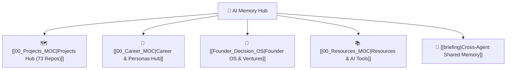

# 🧠 Abhishek Anand — Second Brain & AI Command Hub

Welcome to your central Personal and Professional Second Brain. This Obsidian Vault acts as the single source of truth for all projects, career assets, ventures, and unified multi-agent memory on your machine.

---

## 🧭 High-Level Navigation

---

## ⚡ Core Life & Work Pillars

| Pillar | Description | Central Note |
|---|---|---|
| **🗺️ Projects** | 73 active mapped codebases & repositories | `[[00_Projects_MOC]]` |
| **💼 Career** | IIT ISM Dhanbad, 4 Resumes, Bento Portfolio | `[[00_Career_MOC]]` |
| **🚀 Business** | Odoo WhatsApp CRM, Price Matcher, SaaS apps | `[[Founder_Decision_OS]]` |
| **📚 Resources** | AI Prompt Store, Automation scripts, Toolkits | `[[00_Resources_MOC]]` |
| **🤖 Agent Memory**| Hermes, Claude, Gemini/Antigravity, Codex | `[[briefing|Cross-Agent Briefing]]` |

---

## 🤖 Cross-Agent Shared Memory (Real-Time)
- **Engine:** `scripts/vault-sync.py` (Automatic background sync)
- **Active Agents:** Gemini / Antigravity, Claude Code (40+ profiles), Hermes, Codex, Prime, BrowserOS neo
- **Today's Briefing:** `[[briefing|Cross-Agent Briefing (Last 24h)]]`
- **Agent Registry:** `[[registry|Agent Registry (450+ profiles)]]`

---

## 📌 Fast Access Quicklinks
- 🌐 **Live Portfolio:** [abhishek-anand-portfolio-red.vercel.app](https://abhishek-anand-portfolio-red.vercel.app/)
- 💻 **Active Workspace:** `C:\Users\asus\Desktop\abhishek_personal_data`
- 📁 **Vault Root:** `C:\Users\asus\Documents\Obsidian Vault`
