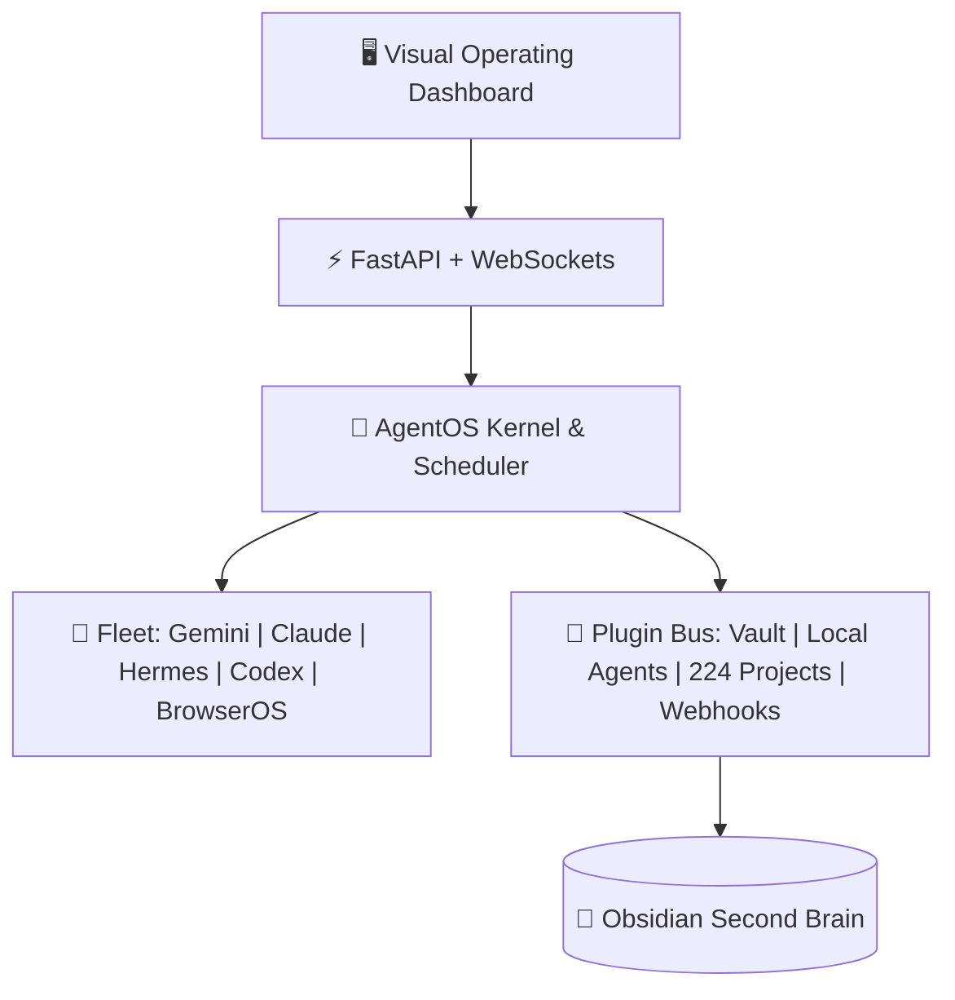

# AgentOS — AI Agent Operating System & Second Brain Telemetry

> **Category:** `Core Repositories and Tools`
> **Lifecycle Status:** `Finished / Production-Ready` (Health Score: **98/100**)
> **Local Path:** `C:/Users/asus/Desktop/abhishek_personal_data/agent_os`
> **Web Dashboard:** `http://127.0.0.1:8000`

---

## 🧭 Overview & Mission
AgentOS is a 10x state-of-the-art, heavily customizable AI Agent Operating System designed specifically for your local multi-agent environment. It unifies **Gemini / Antigravity**, **Claude Code (40+ profiles)**, **Hermes**, **Codex**, **BrowserOS neo**, and **Prime** on top of your **Obsidian Second Brain**, providing:

1. **Living Knowledge Graph in Continuous Motion:** High-performance Canvas physics simulation rendering all 271+ vault nodes and 953+ wikilink edges with orbital physics, category clustering, and pulsating edges.
2. **Slide-over Live Note Inspector:** Instant drawer displaying frontmatter, tags, completion score, and full markdown preview for any clicked node.
3. **Dynamic Starfield Telemetry:** Sci-fi ambient particle constellation canvas with live WebSocket telemetry streaming agent states, active tasks, and kernel events.
4. **Bidirectional Multi-Agent Memory Bridge:** Direct sync integration with `scripts/vault-sync.py`, streaming cross-agent briefings and logging durable episodic memory.



## 🛠️ Technology Stack
- **Core Kernel:** Python 3.11, Pydantic, Event Bus, Priority Task Queues
- **Web Telemetry:** FastAPI, WebSockets, Jinja2, Tailwind CSS, Mermaid.js
- **Obsidian Bridge:** `vault-sync.py` bi-directional IPC, cross-agent briefing streaming

## 🚀 Developer Run Command
```bash
cd "C:/Users/asus/Desktop/abhishek_personal_data/agent_os"
python main.py
```